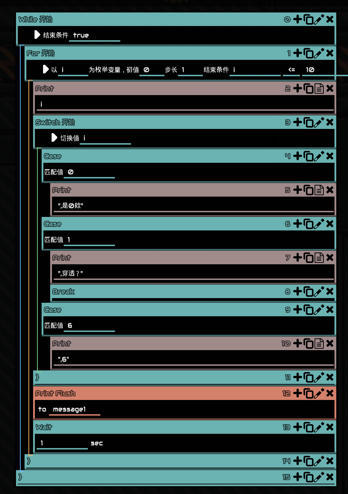

# Logic Sugar

Logic Sugar 让 Mindustry 的逻辑编辑更接近你熟悉的编程方式。你可以直接使用 `for` 、`while` 和 `switch` 结构，并享受清晰的缩进、折叠和错误提示。

Logic Sugar makes Mindustry logic editing feel more like writing familiar code. Use `for`, `while`, and `switch` blocks with readable indentation, folding, and helpful error feedback.

## 开始使用

1. 下载发布页面中的 `.jar` 或 `.zip` 文件。
2. 将文件放入 Mindustry 的 `mods` 文件夹。
3. 重新启动游戏，打开逻辑处理器即可使用。

The same release works on Windows and Linux. Install it like any other Mindustry mod, then open a logic processor to begin.

## 特性

- `for` 循环：支持初值、步长和结束条件
- `while` 循环：用条件控制重复执行
- `switch` 分支：支持 `case` 和 `break`
- 自动缩进、折叠和结构辅助线
- 错误保留在编辑器中，方便修复
- 跳转线着色：按目标或积木类别区分分支
- 框选批处理：批量移动、复制、删除逻辑积木
- `Expr` 表达式积木：编辑时使用表达式，保存时自动转为原版兼容的 `op` 指令

## 致谢

- [logic-assist](https://github.com/nosbhghggg/logic-assist) 提供了跳转线着色、框选批处理和表达式编辑功能的实现基础。

Enjoy clearer logic, faster iteration, and code that remains easy to share.

## License

Logic Sugar is released under the GNU General Public License version 3. See [LICENSE](LICENSE).
