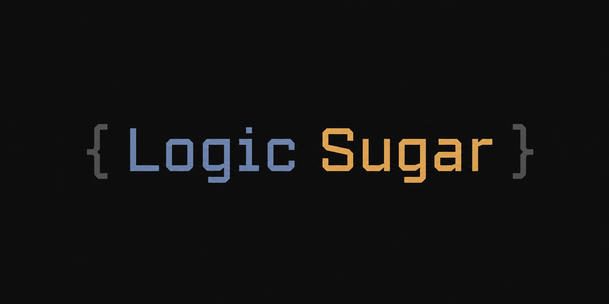

# Logic Sugar

[中文](README_zh.md) | [English](README.md)

<p align="center"></p>

Logic Sugar 为 Mindustry 逻辑编辑器添加了 `for`、`while`、`switch`、`break` 等结构化控制流积木，还提供了跳转线着色、框选批处理和表达式编辑功能。所有内容保存时自动转为原版兼容的 `mlog` 指令。

## 特性

### 结构化语句

在逻辑处理器中编写可读的循环和分支结构，编译为标准 `jump`/`op` 指令——未安装此模组的玩家看到的是普通原版逻辑。

<details>
<summary><b>for</b> — 带初值、步长和结束条件的循环</summary>

```
for i = 0; i < 10; i += 2
  ...
end
```
</details>

<details>
<summary><b>while</b> — 条件循环</summary>

```
while signal == 1
  ...
end
```
</details>

<details>
<summary><b>switch</b> — 多分支选择</summary>

```
switch state
  case 0
    ...
    break
  case 1
    ...
    break
end
```
</details>

- 自动缩进、折叠和结构辅助线
- 错误保留在编辑器中方便修复

### 跳转线着色

为 `jump` 跳转线按目标着色，不同分支清晰可辨。可在游戏模组设置中切换。

- **关闭**：全部白色（原版）
- **分散色**：按目标索引黄金角度 HSV 着色
- **积木色**：按目标积木类别颜色提亮 1.4 倍

### 框选批处理

批量选择、移动、复制、删除逻辑积木。

- 在空白画布上拖动进行框选；**蓝色** = 移动模式，**绿色** = 复制模式（通过选中积木上的复制图标切换）
- `Ctrl` + 点击 → 复制拖动单个积木；`Delete`/`Backspace` → 删除选中；右键/`Esc` → 取消
- 选中后，积木按钮变为批量操作：垃圾桶 → 全部删除，`+` → 复制，复制图标 → 切换模式

### 表达式编辑（`Expr` 积木）

在 `Expr` 积木中编写数学表达式，编译为 `op` 指令链，也可将 `op` 链折叠回可读表达式。

**编译**：`result = cos(a) * 10 + x` →

```
op cos _0 a 0
op mul _0 _0 10
op add x _0 x
```

- **折叠**：打开编辑器时，连续的 `op` 链自动折叠回表达式形式
- **保存**：表达式展开为标准 `op` 指令——原版兼容
- **语法高亮**：数字（金色）、函数（珊瑚色）、变量（白色）、运算符（浅灰）
- **错误提示**：语法错误以红色显示在表达式下方，并标明具体原因

**支持的运算符**

| 类别 | 运算符 |
|---|---|
| 一元函数 | `not abs sign log log10 floor ceil round sqrt rand sin cos tan asin acos atan` |
| 二元函数 | `max(a,b) min(a,b) angle(a,b) angleDiff(a,b) len(a,b) noise(a,b) logn(a,b)` |
| 逻辑 | `\|\|` `&&` ` xor ` |
| 比较 | `==` `!=` `===` `<` `>` `<=` `>=` |
| 位运算 | `&` `<<` `>>` `>>>` |
| 算术 | `+` `-` `*` `/` `//` `%` `%%` `^` |

### 函数（`Func Def` / `Func Call` / `Return` 积木）

把一段逻辑封装为函数：支持参数（完整表达式）、可选返回值、void 函数、提前 `return` 和函数间互相调用（不支持递归）。函数可以定义在处理器内（**本地函数**），也可以写在全局**函数库**里供所有处理器调用。

```
funcdef f a,b          # 定义函数 f，参数 a、b
  op add s a b
  return "s * 2"
blockend
set x 3
funccall f "x, 4" out  # 调用：out = (3+4)*2
```

- **参数**：实参是完整表达式（如 `funccall f "cos(x) * 2"`），在调用点求值后绑定到参数；参数个数必须匹配
- **返回值**：函数体用 `return "<表达式>"` 返回值，调用积木的 `=` 字段接收结果；调用要结果但函数体从不 `return` 值 → 编译报错
- **提前返回**：`return`（无值）或 `return "<表达式>"` 可在任意位置退出函数
- **互相调用**：函数可以调用其他函数（含库函数）；直接/间接递归编译报错并指出环路径
- **跳转限制**：`jump` 不得跨函数边界——函数体内跳转只能指向函数体内部（跳到本函数 `blockend` 视为提前退出）；`break` 只作用于函数体内的循环/switch

**编译模式**（模组设置 → Logic Sugar → 函数模式）：

- `normal`（默认）：每个函数编译为一份共享子程序，调用点用 `@counter` 保存返回地址跳转。成本 ≈ 函数体 + 每次调用 2~3 条指令；调 2~3 次以上就比 inline 划算
- `inline`：每个调用点复制一份函数体（标签按调用点命名空间隔离）。成本 ≈ N × 函数体；调用次数多容易撞 1000 指令上限（报错会提示切换到 normal）

**函数库**（全局函数）：

- 库文件位于 `<游戏数据>/mods/config/LogicSugar/functions.txt`，通过 模组设置 → Logic Sugar → 打开函数库 编辑（复用可视化积木画布，保存时校验）
- 库函数**不能修改调用方变量**：函数体内被写入的变量名自动混淆为 `__ls_func_<函数名>_<原名>`；只读变量原样保留（可读调用方全局变量）；`@` 系统变量、`cell1`/`bank1`/`memory1` 等存储设备豁免
- 库函数只能调用其他库函数；处理器内调用先解析本地函数，找不到再查函数库（本地同名函数优先）
- 未定义的调用、库文件损坏都会给出明确编译错误；不可达的函数体不产生任何指令（零成本）

**保留前缀**：`__ls_`、`__ls_func_`、`__ls_f_`、`__ls_i_` 为编译器保留前缀，函数名、参数名和普通变量请勿使用。

### 滚动条增强

彩色滚动条（每段按积木类别着色）、点击跳转、悬停预览。

## 构建

```
gradlew deploy
```

输出：`build/libs/LogicSugar.jar`（桌面与 Android 通用 JAR）。放入 Mindustry 的 `mods/` 目录即可。

## 致谢

- [logic-assist](https://github.com/nosbhghggg/logic-assist) — 提供了跳转线着色、框选批处理和表达式编辑功能的实现基础
- [MI2-utilities](https://github.com/BlackDeluxeCat/MI2-Utilities-Java) — 拖拽移动和跳转索引转换逻辑
- [mindcode](https://github.com/cardillan/mindcode) — op 链反编译、运算符分类、优化规则
- [MindustryX](https://github.com/TinyLake/MindustryX/) — JUMP 按钮参考实现

## License

GPL-3.0-or-later。参见 [LICENSE](LICENSE)。