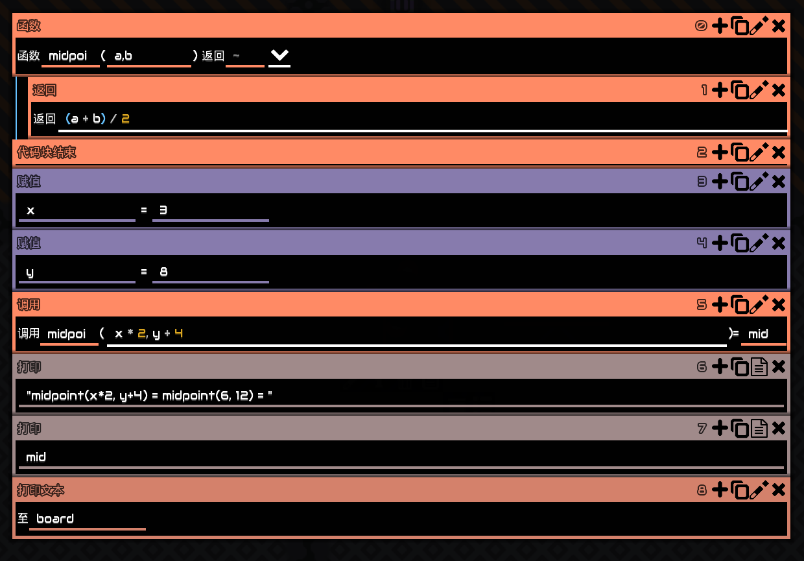
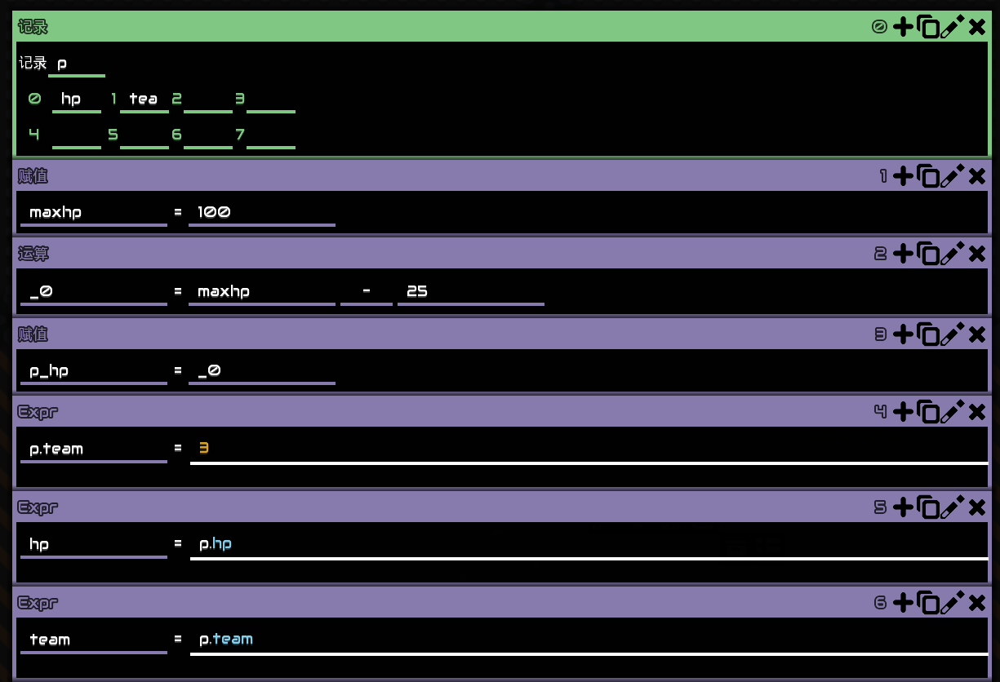
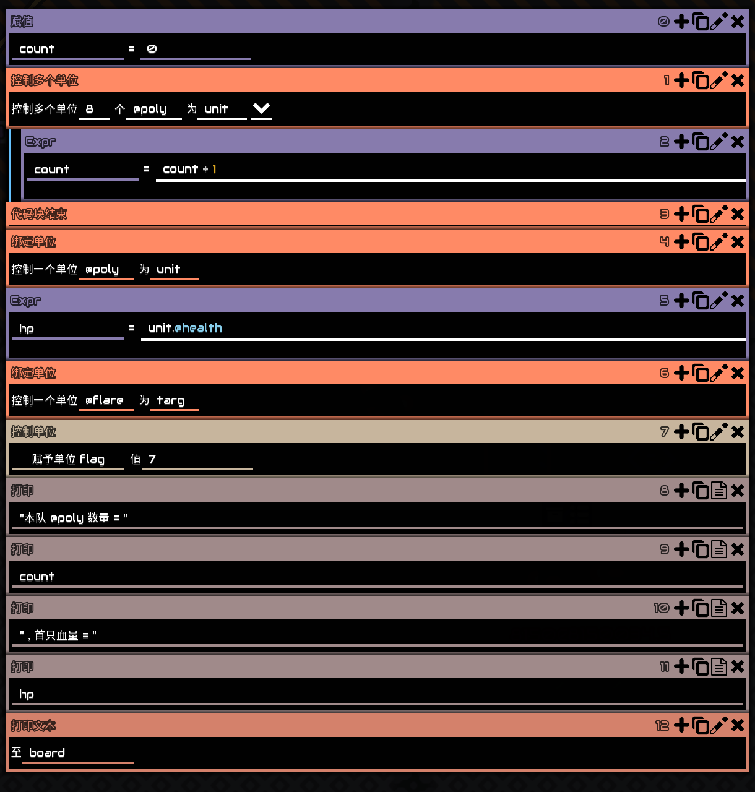

# Logic Sugar

<h1 align="center">
  
  
  
  
</h1>

[中文](README_zh.md) | [English](README.md)

> 让 Mlog 变成高级语言

Logic Sugar 是为熟悉高级语言（包括 Python,C++ 等）的玩家量身定制的。

通过基于对 Mlog 的基本操作的封装，Logic Sugar 实现了 `for`,`Func` 等众多功能。基于链接的内存元，还可以创建例如 `vector`,`map` 等高级数据结构，为 `vector` 等函数提供了类 C++ STL 的内置函数（ `sort` 等）。

Logic Sugar 支持多人游戏，这意味着您也可以高效理解其他同样使用 Logic Sugar 的玩家的代码。

一切旨在让 Mlog 编写更高效。

## 功能

### 结构化控制流

用积木编写常见控制流，保存时编译为普通原版 mlog。

| 结构 | 写法 | 说明 |
| --- | --- | --- |
| 条件分支 | `if`、`elif`、`else` | 以块的形式编写条件分支。 |
| 循环 | `for`、`while` | 以块的形式编写循环。 |
| 循环控制 | `break`、`continue` | 跳出或继续循环。 |
| 多分支 | `switch`、`case` | 把一个值与多个分支匹配。 |

### 表达式与函数

| 功能 | 说明 |
| --- | --- |
| **在条件判断中写表达式** | `if`、`elif`、`while`、`for` 的条件（Expr 模式）可直接写 `hp < 25 && !shielded` 这样的完整表达式。 |
| **Expr积木** | 写 `result = (a + b) * 2`：既可以拖一张 Expr 卡，也可以把这一行直接粘进代码文本；导入时落成 Expr 卡，保存时自动展开为等价指令，重新打开自动折叠回来，写错当场标红。唯一可写的内建变量 `@counter` 同样能写（`@counter = 0`、`@counter = @counter + 1`）。 |
| **随处表达式** | 赋值、函数参数、`return` 返回值等任何值的位置都可以写表达式，包括 `@unit.@health` 成员访问。 |
| **函数** | 定义带参数的函数、调用并返回值；normal（子程序）与 inline（内联）两种模式可在设置中切换。 |
| **函数库** | 所有处理器共享的全局函数，减少重复码字。在设置处直接编辑；最多 10000 条语句。 |

### 数据结构

> [!note]
> 这是原版兼容的，但是部分数据结构的操作复杂度和 C++ `STL` 并不相同，详细查看 [教程目录](docs/tutorials/README.md)

> 由 Logic Sugar 模组创建的，含有特殊积木的 Logic Sugar Code ，下文称作 “糖码”。编译后或由原版编辑器创建的 Mlog 则为 “Mlog”

| 声明 | 类型 |
| --- | --- |
| `array` | 标准数组|
| `matrix` | 二维数组 |
| `span` | 合并内存（多块拼成一段逻辑地址） |
| `record` | 记录 |
| `stack` | 栈 |
| `queue` | 队列 |
| `deque` | 双端队列 |
| `bitset` | 位集 |
| `map` | 哈希表 |
| `uset` | 集合 |
| `list` | 列表 |
| `heap` | 堆 |
| `chain` | 链表 |

支持在Expr中使用 `buf[i]`、`buf[i] = 5` 这样的下标读写

![数组声明，以及在 Expr 里用 buf[i] 读写](Readme_Image/image_183.png)

记录（`record`）的字段同样可以在 Expr 里直接读写：

多块内存可以合并成一段逻辑地址（`span`）：

每种结构在 *添加积木* 界面里对应**一张运算卡**，卡内按钮切换该结构的全部运算——例如栈这张卡提供压入、弹出、查看顶部、大小、清空。实参**每个参数一个输入框**，悬停可见参数名；参数不合法时整卡当场标红。运算卡与该结构的声明卡落在同一栏（数组/矩阵的运算卡在「数组运算」栏）。

每种数据结构都有一章高级教程：声明卡、函数速查表、转译后的 mlog 逐行解释、复杂度与使用须知。从 [教程目录](docs/tutorials/README.md) 开始。

#### getter 语法糖

| 结构 | 支持的写法 |
| --- | --- |
| `list` | `l[i]`、`l.get(i)`、`l.size()`、`l.find(v)` |
| `stack` | `s.top()`、`s.peek()`、`s.size()` |
| `queue` | `q.front()`、`q.peek()`、`q.size()` |
| `deque` | `d.front()`、`d.back()`、`d.size()` |
| `bitset` | `b[i]`、`b.test(i)`、`b.count()` |
| `map` | `m[k]`、`m.get(k)`、`m.has(k)`、`m.size()` |
| `uset` | `s.has(v)`、`s.size()` |
| `chain` | `c[i]`、`c.get(i)`、`c.head()`、`c.next(i)`、`c.len()` |

它们与对应的单独操作积木（如 `vector_at(l, i)`、`stack_top(s)`）完全等价。

![哈希表与集合的声明、运算卡，以及 m[1]、u.has(9)、u.size() 写法](Readme_Image/image_182.png)

### 编辑器、调试与视图

| 功能 | 说明 |
| --- | --- |
| **从源码重建** | 打开已保存的处理器时，会尽量重建 Mlog 为糖码（偏保守，只会尝试恢复控制流，不会恢复数据结构） |
| **编辑器辅助** | Ctrl+点击与 Ctrl+拖动复制积木、悬停提示（比屏幕宽时自动折行，不再溢出屏幕）、搜索高亮、撤销与重做（电脑 `Ctrl+Z`、`Ctrl+Y`，手机底部按钮），以及编译后指令条数对照上限的实时显示。 |
| **跨逻辑复制粘贴** | 编辑菜单里的「复制选区 / 粘贴选区」，电脑上也可直接 `Ctrl+C` / `Ctrl+V`。剪贴板里存的是**糖码本身**，粘到别的处理器上仍然是一张张可继续编辑的积木；含跳转到选区之外的积木会被拒绝（数字下标换个程序就没有意义）。 |
| **断言语句** | 提供了一些可用于调试并显示报错信息在处理器头上的语句，具体可看 [上游README](https://github.com/cardillan/MlogAssertions/blob/main/README.md) |
| **变量 / 内存 / 属性界面** | 查看并修改处理器的变量、内存块内容（可导出/导入剪贴板或文件），或任意建筑/单位的传感器读数（`属性` 界面，也可以三击方块打开）。数值按完整精度显示，排序、过滤、对齐与刷新频率都可配置；含 `[` 的字符串按原文显示，超长字符串会被截断而不是卡住界面。 |
| **快照** | 保存一块方块的状态以便随时回看：*孤立*（只该实体）、*连通*（该实体 + 变量引用到的全部建筑/单位，含处理器正在控制的单位）、*录制*（初始状态 + 接下来 N 条指令，每条指令一份子快照）与*全局*（全部逻辑方块）。可以从界面或 `snapshot` 指令创建、逐份恢复，并按每方块上限自动裁剪（录制子快照同样计入上限）。 |
| **性能分析器** | 统计每条指令的执行次数（或消耗的指令预算），以及分支比例与代码覆盖率；可排序、可复制为 TSV，从变量界面的 📊 按钮或 `profile` 指令控制。统计数据只在你自己的客户端上，不影响游戏进程。 |
| **单位快照与逐指令录制** | 连通快照会把处理器控制的单位一并收进去；录制快照显示每条被记录指令执行前的变量状态，并默认只显示该指令用到的变量。调试构建下可以用 `restart <block>` 配合 `snapshot recording` 从另一台处理器录制目标处理器的初始化代码。 |
| **处理器状态指示** | 停机的处理器头顶显示停在哪一条，长等待的处理器画进度圆环，运行出错原地显示消息（有期望值与实际值一并显示）。 |
| **单位 flag 显示** | 设置中可选：在单位正上方显示其逻辑 flag，不同 flag 使用不同的鲜明颜色；默认值 0 不显示。 |
| **复制变量与打印缓冲** | 在**编辑菜单**里：把当前处理器的全部变量按名称整理成保留完整精度的表格复制到剪贴板（可直接粘贴进电子表格），或复制 Mlog 的输出缓冲区。这两个按钮原先占着底部栏的固定宽度，已移到编辑菜单，窄窗口下的底栏因此不再被顶出屏幕。 |
| **逻辑编辑器冲突** | 设置项。其它模组（例如「逻辑工具」）同样会替换 `Vars.ui.logic` 来接管逻辑编辑器，而两个模组只能有一个生效，可在四档中选择：**每次启动询问**（默认，启动时弹一次选择框；选完后本次会话按该答案执行，设置仍停在「询问」所以下次启动还会问）、**接管**（保留 LogicSugar 编辑器、替换对方界面）、**让位**（保留对方编辑器，同时停用 LogicSugar 的编辑器与语法）、**共存**（保留对方整套编辑器界面，LogicSugar 的画布运行在其中，双方功能同时可用）。不回答、直接点掉选择框等于「让位」，不会误选破坏性的接管。切换后立即生效。 |

执行出错、停机位置与长等待进度会直接显示在处理器头顶：

  
  
  

单位控制积木与单位 flag 显示：

> [!note]
> 为了让几 KB 的糖码载体不被执行，编译产物会在 main 末尾多出一条 `set @counter 0`。它是真实指令、与载体一起计入上限，因此**处理器的有效指令上限是上限减一（999 条）**；顶格的旧程序重新保存时会提示超限。

## 安装

最新版本见页面顶部的 **Latest Release** 徽章，需要 **Mindustry v160.1 或更高版本**（桌面或 Android）。从 [Releases](https://github.com/DeterMination-Wind/LogicSugar/releases) 下载通用 JAR，放进 Mindustry 的 mods 目录，启动游戏后在模组列表里启用，再打开逻辑处理器编辑器即可使用。

> [!note]
> 若网络环境不支持 Github 高速下载，可以加入 [qq群](https://qm.qq.com/q/QjHwsXMQ48) ，或者使用 [游戏启动器](https://github.com/DeterMination-Wind/Xenon) 获得国内服务器镜像下载功能

## 从源码构建

前置条件：

- **Java 17+**
- 仓库旁有一份构建好的 Mindustry 源码（编译依赖 `../Mindustry-master/desktop/build/libs/Mindustry.jar`）
- 打包 Android 端需要本地 Android SDK 的 **D8** 和至少一个 platform 的 `android.jar`（通过 `ANDROID_SDK_ROOT`、`ANDROID_HOME` 或 `D8_PATH` 环境变量指定）

~~~powershell
.\gradlew.bat deploy
~~~

输出的 `build/libs/LogicSugar-v<版本>.jar` 是一个同时支持桌面与 Android 的跨平台 JAR；普通的 `build` 任务同样会触发 deploy。

## 致谢

Logic Sugar 的部分设计与实现受益于以下项目，感谢这些作者的付出：

- [MlogAssertions](https://github.com/cardillan/MlogAssertions)（MIT）—— 调试子系统直接移植自该项目（断言、变量/内存/属性界面、快照与性能分析器），语句格式与其保持兼容，目前，Mindcode 生成的断言代码可直接在 Logic Sugar 中打开。
- [Mindcode](https://github.com/cardillan/mindcode)（MIT）—— 表达式子系统（Expr）的部分思路来源于此。
- [mindustry_logic_bang_lang](https://github.com/A4-Tacks/mindustry_logic_bang_lang)（GPL-3.0）—— 反编译系统与静态检查的思路参考（跳转链穿线、logic_lint 风格检查）。
- [logic-assist](https://github.com/nosbhghggg/logic-assist)（GPL-3.0）—— 跳转线按目标着色的思路来源，本项目最初基于此 Mod 开发
- [MI2-Utilities](https://github.com/BlackDeluxeCat/MI2-Utilities)（GPL-3.0）logic-assist 的致谢中包含了 Mi2U ~虽然我也不知道为什么~

## 负责任地使用 AI

本项目除 README 和部分 Doc 外，几乎全部由 AI 生成。秉持*负责任地使用 AI* 的原则，我简要说明一下项目的历史：

1. 本项目最早由 Claude Opus 4.6 开发。当时 Claude 订阅出现 Bug，Opus 4.6 因而可免费使用，我也借此机会把自己的想法实现成了这个 demo。
2. 在后续开发中，我不断从自己的 Mlog 编写经历中，寻找 Mod 能让写 Mlog 更便捷的地方。显示方面，目前的 QoL Mod 已接近成熟；但在编译器方面，似乎还没有一个能在游戏内实时查看的编译器可用。
3. 与本项目一同诞生的还有 `MlogStudio`、`MlogSugar` 等暂不维护的项目。以 `MlogStudio` 为例，我在制作过程中意识到，要在*游戏外*的 Mlog 编辑器中实现实时预览非常困难，这促使我转向游戏内编译器的开发。
4. 这个项目最初只想实现 `For` / `While` 循环，当时的最终目标也只是 `Func` 功能。但后来我发现它对逻辑编写极为便利，于是开始制作一些更高级、更常用的积木/小功能。
5. 如果你好奇的话：本项目先后使用 `Opus 4.6` -> `GPT-5.5` -> `GPT-5.6-Sol / Luna` -> `DeepSeek V4(.1) Flash` 开发。在 `DeepSeek Harness` 发布后，我学习了其出色的 Doc 架构，并改造了 `LogicSugar`，使 `DeepSeek V4.1 Flash` 的能力即可满足项目开发需求。如果你也想用 AI 参与开发，那当然很好。但请始终记住：**负责任地使用 AI**，你需要对自己的代码负责。因此，我建议维护者在 Push 代码前，先用单独的 Subagent Review 一遍，这可能会发现不少低级问题。

## 许可证

本项目基于 [GNU GPL v3](LICENSE) 许可证开源。
